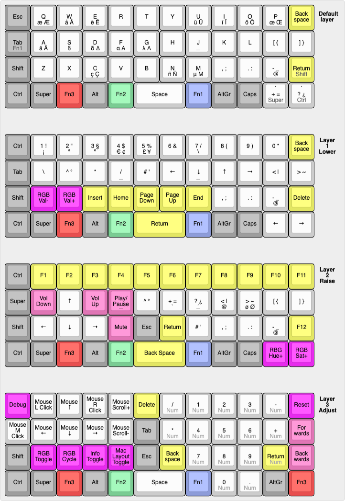
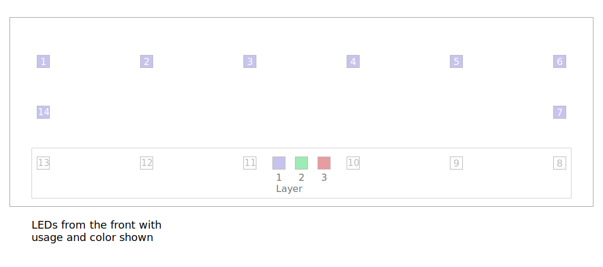

# Personal layout

This is my personal layout for the niu mini. It uses 4 different layers (base, lower, raise, adjust). Many of the features are a combination of different layouts and designs such as the planck but also the signum 3 by Troy Fetcher.

For an overview of the layout see [this](https://www.keyboard-layout-editor.com/#/gists/681891570020fad2fdec17477216f398)

> the center legend shows normal keypress, followed by shifted keypress (most of the time). Keys below that are usually accessible via Alt(Gr) and are followed by their shifted counterparts. Sometimes descriptions are too long and need line wrapping. For the media controls the line below is accessed via Shift not Alt(Gr). If the bottom text is done in a different color it usually means that this functionality is accessed by pressing the key instead of tapping it. "Num" is the exception, it just signals that the numberpad keys are used instead of the normal ones.

> Color coding:
> light grey / white: normal key
> grey: modifier
> yellow: Insert, Delete, F1-F12, ...
> pink: media controls and forwards / backwards
> purple: keyboard related keys
> others: layer keys

## Features

- all normal keys and characters (I personally use an almost completely custom xkb layout, it could be that without it some characters are missing on ISO layouts duo to the missing key ANSI boards have that I had to accomodate previously with the xkb layout)
- All keys a normal 104-key keyboard has (with the exception of break/pause and scroll lock) are available
  - arrow keys
  - F1-F12
  - numpad
  - delete, insert, page up, ...
- mouse support (moving mouse, clicking & scrolling)
- media controls (play/pause, next/prev track and volume up/down)
- vim emulation (based on [xton's vim emulation](https://github.com/qmk/qmk_firmware/tree/master/users/xtonhasvim); **still WIP**)
  - accessable via the key labeled "Vim Mode"
  - exit by pressing Esc in normal mode
- RGB LED backlight integration
  - breadthing, snake, fixed color, ... modes
  - color is configurable using hue, saturation & value keys on the raise layer
  - optional layer / state indicator (toggleable via the "Info Toggle" key; displays current OS layout and vim mode as well)
- MacOS and Linux layouts (minor differences; requires software mapping of F20 to the apple fn key (which is pretty much [proprietary](https://github.com/qmk/qmk_firmware/issues/2179); this is a work around))
- Layout optimized for ergonomics and ease of typing: Most actions don't require pressing awkward button combinations with one hand. The work is split between both hands if possible

## LED setup

