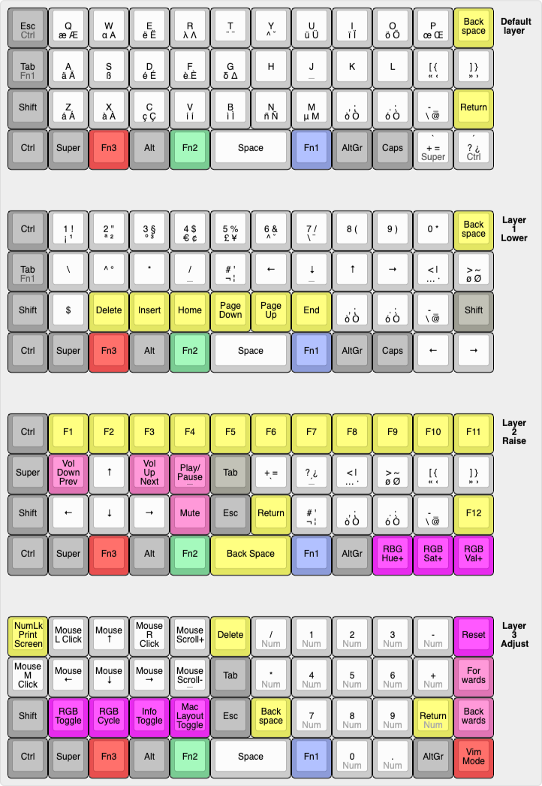

# Personal layout

This is my personal layout for the niu mini. It uses 4 different layers (base, lower, raise, adjust). Much of the features are a combination of different layouts and designs such as the planck but also the signum 3 by Troy Fetcher.

For an overview of the layout see [this](http://www.keyboard-layout-editor.com/#/gists/681891570020fad2fdec17477216f398)

> the center legend shows normal keypress, followed by shifted keypress (most of the time). Keys below that are usually accessible via Alt(Gr) and are followed by their shifted counterparts. Sometimes descriptions are too long and need line wrapping. For the media controls the line below is accessed via Shift not Alt(Gr).

> Color coding:
> light grey / white: normal key
> grey: modifier
> yellow: Insert, Delete, F1-F12, ...
> pink: media controls and forwards / backwards
> purple: keyboard related keys
> others: layer keys

## Features

- all normal keys and characters (I personally use an almost completely custom xkb layout, it could be that without it some characters are missing on ISO layouts duo to the missing key ANSI boards have that I had to accomodate previously with the xkb layout)
- arrow keys
- F1 to F12
- Page Up, Page Down, Insert, Delete, ... (with the exception of break/pause and scroll lock **all** keys on a normal 104-key keyboard are present, with a few extra ones added on top)
- mouse support
- full numberpad
- media controls
- vim emulation (based on [xton's vim emulation](https://github.com/qmk/qmk_firmware/tree/master/users/xtonhasvim); **still WIP**)
- LED integration (normal backlighting but also showing the state of the keyboard when "Info Toggle" is on)
- MacOS and Linux layouts (minor differences; requires software mapping of F20 to the apple fn key (which is pretty much [proprietary](https://github.com/qmk/qmk_firmware/issues/2179); this is a work around))
- Layout optimized for ergonomics and ease of typing: Most actions don't require pressing awkward button combinations with one hand. The work is split between both hands if possible

## LED setup

